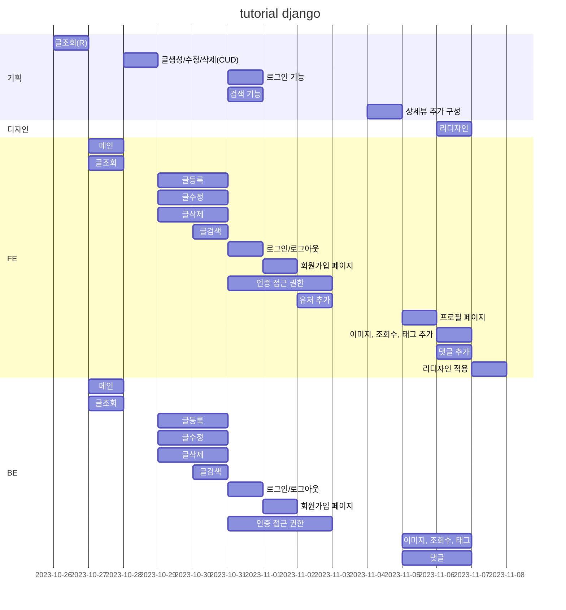

# 📖 책 대여 홈페이지 Pil Library

- 배포 URL :
- Test ID : user01
- Test PW : 1234
- Admin Test ID : admin
- Admin Test PW : 1234

<br>

## 프로젝트 소개

- Pil Library는 책을 좋아하는 사람들이 책을 대여해서 읽을 수 있는 홈페이지입니다.
- 검색을 통해 다양한 책들을 구경할 수 있습니다.
- 관리가 기능을 통해 도서 관리, 주문 관리, 회원 관리, 통계분석을 할 수 있습니다.
- 읽은 책에 관해 리뷰를 작성할 수 있습니다.

<br>

## 팀원 구성

<div align="center">

| **박승필** |

</div>

<br>

## 1. 개발 환경

- Front : HTML, CSS, JavaScript, Boot-strap, thymeleaf
- Back-end : Java, SpringBoot, Mybatis
- Database : Oracle
- 버전 및 이슈관리 : Github
- 서비스 배포 환경 : AWS(예정)
  <br>

## 2. 채택한 개발 기술

### Boot-strap

- Boot-strap
  - 홈페이지 레이아웃 부분을 쉽게 구성할 수 있었습니다.

### Thymeleaf

- 서버에서 클라이언트에게 응답할 브라우저 화면을 보여주고자 했습니다.
- 화면 구성을 서버 가동없이 쉽게 파악할 수 있어 개발에 수정할 때마다 서버 재가동이 필요 없어지기 때문에 개발에 용이해졌습니다.

<br>

## 3. 프로젝트 구조

```
├── pom.xml
├── .gitignore
├── README.md
│
└── src
     ├── main
     │     └── java
     │     │     ├── com.library.basic
     │     │     │     ├── GlobalControllerAdvice.java
     │     │     │     ├── HomeController.java
     │     │     │     ├── LibraryApplication.java
     │     │     │     ├── .admin
     │     │     │     │     ├── .book
     │     │     │     │     │     ├── AdminBookController.java
     │     │     │     │     │     ├── AdminBookService.java
     │     │     │     │     │     ├── AdminBookMapper.java
     │     │     │     │     │     ├── BookDTO.java
     │     │     │     │     │     └── BookVO.java
     │     │     │     │     ├── .category
     │     │     │     │     ├── .order
     │     │     │     │     ├── .qna
     │     │     │     │     ├── .review
     │     │     │     │     ├── .staticanlysis
     │     │     │     │     ├── .user
     │     │     │     │     │     └── .mailing
     │     │     │     ├── .common
     │     │     │     │     ├── .constants
     │     │     │     │     │     └── Constants.java
     │     │     │     │     ├── .dto
     │     │     │     │     │     ├── Criteria.java
     │     │     │     │     │     └── PageDTO.java
     │     │     │     │     ├── .interceptor
     │     │     │     │     │     ├── AdminInterceptor.java
     │     │     │     │     │     └── LoginInterceptor.java
     │     │     │     │     ├── .util
     │     │     │     │     │     └── FileMangerUtils.java
     │     │     │     ├── .mail
     │     │     │     ├── .usr
     │     │     │     │     ├── .book
     │     │     │     │     ├── .cart
     │     │     │     │     ├── .kakaologin
     │     │     │     │     ├── .kakaopay
     │     │     │     │     ├── .naverlogin
     │     │     │     │     ├── .order
     │     │     │     │     ├── .payment
     │     │     │     │     ├── .qna
     │     │     │     │     ├── .review
     │     │     │     │     └── .search
     │     └── resource
     │     │     ├── mail
     │     │     │     └── email.properties
     │     │     ├── mapper
     │     │     │     ├── oracle
     │     │     │     │     └── AdminBookMapper.xml
     │     │     │     │                 .
     │     │     │     │                 .
     │     │     │     │                 .
     │     │     │     └── mysql
     │     │     ├── static
     │     │     │     ├── css
     │     │     │     ├── image
     │     │     │     └── js
     │     │     ├── templates
     │     │     │     ├── admin
     │     │     │     ├── layout
     │     │     │     ├── mailtemplate
     │     │     │     ├── user
     │     │     │     └── index.html
     │     │     ├── application.properties
     │     │     ├── log4jdbc.log4j2.properties
     │     │     └── logback-spring.xml

```

<br>

## 4. 역할 분담

### 🍊박승필

- **UI**
  - 페이지 :
  - 공통 컴포넌트 : 게시글 템플릿, 버튼
- **기능**
  - 유저 검색, 게시글 등록 및 수정, 게시글 상세 확인, 댓글 등록, 팔로워 게시글 불러오기, 좋아요 기능

<br>

## 5. 개발 기간 및 작업 관리

### 개발 기간

- 전체 개발 기간 : 2024-06-20 ~ 2024-08-17(예정)

### 4.1 개발 일정(WBS)

- 아래 일정표는 머메이드로 작성했습니다.



### 5.1 개발 일정(WBS)

- 아래 일정표는 머메이드로 작성했습니다.



<br>

```mermaid
gantt
    title Pil Library
    dateFormat YY-MM-DD
    section 기획
        회원가입(C) :2024-06-20, 1d
        로그인 기능 :2024-06-21, 1d
        아이디 찾기, 비밀번호 찾기 :2024-06-22, 1d
        마이페이지(RUD) :2024-06-22, 1d
        관리자 로그인 기능 : 2024-06-24, 1d
        관리자 도서관리(CRUD) :2024-06-25, 1d
        카테고리 기능(R) :2024-06-28, 1d
        도서 기능(CR) :2024-07-02, 1d
        SnS 로그인 기능 : 2024-07-03, 1d
        게시판 기능(CRUD) : 2024-07-08, 1d
        장바구니기능(CRUD) : 2024-07-11, 1d
        주문기능(CR) : 2024-07-15, 1d
        관리자 주문관리(RUD) : 2024-07-22, 1d
        관리자 게시판관리(RUD) : 2024-07-24, 1d
        괸라자 회원관리(CRUD) : 2024-07-26, 1d
        마이페이지 게시판(RUD) : 2024-07-28, 1d
        관리자 회원관리(RUD) : 2024-07-29, 1d
        관리자 통계분석(R) : 2024-07-30, 1d
        마이페이지 주문내역(R) : 2024-07-31, 1d


    section 디자인

    section FE
        메인    :2024-06-20, 1d
        회원가입 페이지 :2024-06-20, 1d
        로그인/로그아웃 :2024-06-21, 1d
        아이디 찾기, 비밀번호 찾기 :2024-06-22, 1d
        마이페이지 :2024-06-22, 2d
        회원정보 수정 :2024-06-22, 2d
        비밀번호 변경 :2024-06-22, 2d
        회원 탈퇴 :2024-06-22, 2d
        관리자 페이지 :2024-06-24, 1d
        관리자 로그인/로그아웃 :2024-06-24, 1d
        도서등록 :2024-06-25, 2d
        도서목록 :2024-06-27, 2d
        체크도서삭제 :2024-06-28, 1d
        도서수정 :2024-06-28, 1d
        도서삭제 :2024-06-28, 1d
        nav바 1,2차 카테고리 표시 :2024-06-28, 3d
        도서목록 :2024-07-02, 1d
        도서 상세페이지 : 2024-07-03, 1d
        카카오 로그인,로그아웃 기능 : 2024-07-03, 2d
        네이버 로그인,로그아웃 기능 : 2024-07-05, 2d
        도서 리뷰 목록 : 2024-07-08, 1d
        도서 리뷰 작성 : 2024-07-08, 1d
        도서 리뷰 수정폼 : 2024-07-09, 1d
        도서 리뷰 수정 : 2024-07-09, 1d
        도서 리뷰 삭제 : 2024-07-09, 1d
        도서 QnA 목록 : 2024-07-10, 1d
        도서 QnA 작성 : 2024-07-10, 1d
        도서 QnA 상세폼 : 2024-07-11, 1d
        도서 QnA 수정 : 2024-07-11, 1d
        도서 QnA 삭제 : 2024-07-11, 1d
        장바구니 목록 : 2024-07-12, 2d
        장바구니 추가  :2024-07-12, 1d
        장바구니 선택삭제 :2024-07-14, 1d
        장바구니 전체삭제 :2024-07-14, 1d
        장바구니 수량변경 :2024-07-14, 1d
        주문내역 목록 :2024-07-15, 1d
        주문자 정보와 동일 : 2024-07-15, 1d
        결제기능-카카오페이 : 2024-07-16, 3d
        결제기능-무통장입금 : 2024-07-19, 1d
        검색 목록 페이지 : 2024-07-21, 2d
        관리자 주문목록 : 2024-07-22, 1d
        관리자 해당 주문 삭제 : 2024-07-22, 1d
        관리자 주문 상세보기 : 2024-07-23, 2d
        관리자 주문 상세보기 수정 : 2024-07-24, 1d
        관리자 주문도서 삭제  : 2024-07-24, 1d
        관리자 리뷰목록 : 2024-07-25, 1d
        관리자 리뷰 상세보기 : 2024-07-25, 1d
        관리자 리뷰 수정 : 2024-07-25, 1d
        관리자 리뷰 삭제 : 2024-07-25, 1d
        관리자 QnA목록 : 2024-07-26, 1d
        관리자 QnA 상세보기 : 2024-07-26, 1d
        관리자 QnA 수정 : 2024-07-26, 1d
        관리자 QnA 삭제 : 2024-07-26, 1d
        관리자 메일 발송 : 2024-07-27, 1d
        관리자 메일 목록 : 2024-07-27, 1d
        관리자 메일 상세보기 : 2024-07-27, 1d
        관리자 메일 수정 : 2024-07-27, 1d
        관리자 메일 삭제 : 2024-07-27, 1d
        나의 리뷰 목록 : 2024-07-28, 1d
        나의 리뷰 상세보기  : 2024-07-28, 1d
        나의 리뷰 수정 : 2024-07-28, 1d
        나의 리뷰 삭제 : 2024-07-28, 1d
        나의 QnA 목록 : 2024-07-28, 1d
        나의 QnA 상세보기  : 2024-07-28, 1d
        나의 QnA 수정 : 2024-07-28, 1d
        나의 QnA 삭제 : 2024-07-28, 1d
        관리자 회원 목록 : 2024-07-29, 2d
        관리자 회원 상세보기 : 2024-07-30, 1d
        관리자 회원 정보 수정 : 2024-07-30, 1d
        관리자 회원 삭제 : 2024-07-30, 1d
        관리자 월별 매출관리 : 2024-07-31, 2d
        나의 주문내역 목록 : 2024-07-31, 1d
        나의 주문내역 상세보기 : 2024-07-31, 1d



    section BE
        메인    :2024-06-20, 1d
        회원가입 페이지 :2024-06-20, 1d
        로그인/로그아웃 :2024-06-21, 1d
        아이디 찾기, 비밀번호 찾기 :2024-06-22, 1d
        마이페이지 :2024-06-22, 2d
        회원정보 수정 :2024-06-22, 2d
        비밀번호 변경 :2024-06-22, 2d
        회원 탈퇴 :2024-06-22, 2d
        관리자 페이지 :2024-06-24, 1d
        관리자 로그인/로그아웃 :2024-06-24, 1d
        도서등록 :2024-06-25, 2d
        도서목록 :2024-06-27, 2d
        체크도서삭제 :2024-06-28, 1d
        도서수정 :2024-06-28, 1d
        도서삭제 :2024-06-28, 1d
        nav바 1,2차 카테고리 표시 :2024-06-28, 3d
        도서목록 :2024-07-02, 1d
        도서 상세페이지 : 2024-07-03, 1d
        카카오 로그인,로그아웃 기능 : 2024-07-03, 2d
        네이버 로그인,로그아웃 기능 : 2024-07-05, 2d
        도서 리뷰 목록 : 2024-07-08, 1d
        도서 리뷰 작성 : 2024-07-08, 1d
        도서 리뷰 수정폼 : 2024-07-09, 1d
        도서 리뷰 수정 : 2024-07-09, 1d
        도서 리뷰 삭제 : 2024-07-09, 1d
        도서 QnA 목록 : 2024-07-10, 1d
        도서 QnA 작성 : 2024-07-10, 1d
        도서 QnA 상세폼 : 2024-07-11, 1d
        도서 QnA 수정 : 2024-07-11, 1d
        도서 QnA 삭제 : 2024-07-11, 1d
        장바구니 목록 : 2024-07-12, 2d
        장바구니 추가  :2024-07-12, 1d
        장바구니 선택삭제 :2024-07-14, 1d
        장바구니 전체삭제 :2024-07-14, 1d
        장바구니 수량변경 :2024-07-14, 1d
        주문내역 목록 :2024-07-15, 1d
        주문자 정보와 동일 : 2024-07-15, 1d
        결제기능-카카오페이 : 2024-07-16, 3d
        결제기능-무통장입금 : 2024-07-19, 1d
        검색 목록 페이지 : 2024-07-21, 2d
        관리자 주문목록 : 2024-07-22, 1d
        관리자 해당 주문 삭제 : 2024-07-22, 1d
        관리자 주문 상세보기 : 2024-07-23, 2d
        관리자 주문 상세보기 수정 : 2024-07-24, 1d
        관리자 주문도서 삭제  : 2024-07-24, 1d
        관리자 리뷰목록 : 2024-07-25, 1d
        관리자 리뷰 상세보기 : 2024-07-25, 1d
        관리자 리뷰 수정 : 2024-07-25, 1d
        관리자 리뷰 삭제 : 2024-07-25, 1d
        관리자 QnA목록 : 2024-07-26, 1d
        관리자 QnA 상세보기 : 2024-07-26, 1d
        관리자 QnA 수정 : 2024-07-26, 1d
        관리자 QnA 삭제 : 2024-07-26, 1d
        관리자 메일 발송 : 2024-07-27, 1d
        관리자 메일 목록 : 2024-07-27, 1d
        관리자 메일 상세보기 : 2024-07-27, 1d
        관리자 메일 수정 : 2024-07-27, 1d
        관리자 메일 삭제 : 2024-07-27, 1d
        나의 리뷰 목록 : 2024-07-28, 1d
        나의 리뷰 상세보기  : 2024-07-28, 1d
        나의 리뷰 수정 : 2024-07-28, 1d
        나의 리뷰 삭제 : 2024-07-28, 1d
        나의 QnA 목록 : 2024-07-28, 1d
        나의 QnA 상세보기  : 2024-07-28, 1d
        나의 QnA 수정 : 2024-07-28, 1d
        나의 QnA 삭제 : 2024-07-28, 1d
        관리자 회원 목록 : 2024-07-29, 2d
        관리자 회원 상세보기 : 2024-07-30, 1d
        관리자 회원 정보 수정 : 2024-07-30, 1d
        관리자 회원 삭제 : 2024-07-30, 1d
        관리자 월별 매출관리 : 2024-07-31, 2d
        나의 주문내역 목록 : 2024-07-31, 1d
        나의 주문내역 상세보기 : 2024-07-31, 1d


```

### 작업 관리

- GitHub를 통해 소스들을 관리했습니다.

<br>

## 6. 페이지별 기능

### [사용자]

### [초기화면]

- 서비스 접속 초기화면으로 index.html 화면이 나타납니다.
- slick 라이브러리를 이용해 메인화면 이미지를 자동 전환 시켰습니다.
  - 로그인이 되어 있지 않은 경우 : 로그인, 회원가입, 장바구니, 마이페이지
  - 로그인이 되어 있는 경우 : 로그아웃, 장바구니, 마이페이지
- SNS(카카오톡, 네이버) 로그인 기능을 구현했습니다.

| 초기화면 |
| -------- |


<br>

### [회원가입]

- 아이디를 입력하면 입력창에서 바로 유효성 검사가 진행되고 통과하지 못한 경우 경고 문구가 입력창 우측에 표시됩니다.
- 이메일 주소 입력시 인증코드가 발급되고 입력창에 입력하고 인증 확인시, 유효 검사가 진행되어 통과하지 못한 경우 경고 문구가 입력창 우측에 표시됩니다.
- 카카오지도 API를 사용하여 우편번호를 검색가능하게 했습니다.
- 작성이 완료된 후, 버튼을 클릭하면 유효성 검사가 통과된 경우 로그인 페이지로 이동합니다.

| 회원가입  |
| --------- |
|  |

<br>

### [로그인]

- 아이디와 비밀번호를 입력후, 로그인 버튼 클릭시 유효성 검사가 진행되고 통과하지 못한 경우 각 경고 문구가 입력창 하단에 표시됩니다.
- 로그인 버튼 클릭 시 이메일 주소 또는 비밀번호가 일치하지 않을 경우에는 경고 문구가 나타나며, 로그인에 성공하면 홈 피드 화면으로 이동합니다.

| 로그인     |
| ---------- |
|  |

<br>

### [SNS 로그인]

- 카카오 및 네이버 로그인 API를 사용하여 로그인 기능을 구현했습니다.
- 카카오 또는 네이버 로그인 버튼 클릭시, 가입되지 않은 경우 회원가입 화면으로 이동합니다.

| SNS 로그인 |
| ---------- |
|  |

<br>

### [로그아웃]

- 메인화면 상단에 로그아웃 버튼을 클릭하면 로그아웃이 됩니다.
- 로그아웃시 로컬 저장소의 토큰 값과 사용자 세션정보를 삭제 후, 초기화면으로 이동합니다.

| 로그아웃    |
| ----------- |
|  |

<br>

### [마이페이지]

- 마이페이지 : 로그인 한 회원 정보를 보여줍니다.
  - 수정 : 입력란에 수정 정보를 입력 후, 수정 버튼 클릭시 회원정보가 수정됩니다.
  - 비밀번호 변경 : 입력란에 현재 비밀번호 및 신규 비밀번호를 입력 후, 변경 버튼 클릭시 비밀번호가 변경됩니다.
    - 클라이언트에서 받은 현재 비밀번호와 db에 저장된 비밀번호가 일치한지 확인합니다.
    - 일치하면, 클라이언트에서 받은 신규 비밀번호를 암호화하여 database에 저장합니다.
  - 회원탈퇴 : 입력란에 비밀번호를 입력 후, 탈퇴 버튼 클릭 시 회원 탈퇴가 됩니다.
    - 클라이언트에서 받은 비밀번호와 db에 저장된 비밀번호가 일치한지 확인 후, 일치하면 database에 저장된 회원정보를 삭제합니다.
  - 나의 리뷰 : 사용자가 입력한 리뷰들을 목록으로 보여줍니다.
    - 검색 : 리뷰 제목을 입력 시, 해당 리뷰가 검색됩니다.
    - 상세보기 : 상세보기 클릭 시, 해당 리뷰 정보가 나옵니다.
    - 수정 : 입력란에 수정할 내용을 입력 후, 수정 버튼 클릭시 수정이 됩니다.
    - 삭제 : 삭제 버튼 클릭시 해당 리뷰가 삭제 됩니다.
  - 나의 QnA : 사용자가 입력한 QnA들을 목록으로 보여줍니다.
    - 검색 : QnA 문의종류 또는 제목을 입력 시, 해당 QnA가 검색됩니다.
    - 상세보기 : 상세보기 클릭 시, 해당 QnA 정보가 나옵니다.
    - 수정 : 입력란에 수정할 내용을 입력 후, 수정 버튼 클릭시 수정이 됩니다.
    - 삭제 : 삭제 버튼 클릭시 해당 리뷰가 삭제 됩니다.
  - 나의 주문내역 : 사용자가 주문한 주문내역을 목록으로 보여줍니다.
    - 검색 : 날짜를 입력 시, 해당 주문내역이 검색됩니다.
    - 상세보기 : 상세보기 클릭 시, 해당 주문내역 상세 정보가 나옵니다.

| 마이페이지  |
| ----------- |
|  |

<br>

### [책종류 카테고리]

- 책종류 클릭시, 1차 카테고리가 표시됩니다.
- 1차 카테고리 항목 중 하나를 클릭시, 2차 카테고리가 표시됩니다.
- 2차 카테고리 클릭시, 해당 카테고리 책 목록 페이지로 이동합니다.

| 책종류 카테고리 |
| --------------- |
|    |

<br>

### [자료검색]

- 도서명, 저자 혹은 출판사를 검색할 수 있습니다.
- 해당되는 단어로 검색이 안될시, 입력란 하단에 표시됩니다.
- 클릭 시 해당 책 상세 페이지로 이동합니다.

| 자료검색    |
| ----------- |
|  |

<br>

### [책목록]

#### 1. 책 목록

- 클릭한 카테고리에 해당하는 책 정보들이 목록으로 표시됩니다.
- 표시된 책들의 대출상태 여부를 확인할 수 있습니다..
- 바로구매 혹은 장바구니 버튼 클릭시 해당 페이지로 이동할 수 있습니다.
- 책 이미지 클릭시, 해당 책 상세 페이지로 이동합니다.

#### 2. 책 상세페이지

- 해당 책 상세정보가 표시됩니다.
- 해당 책 도서리뷰가 표시됩니다.
  - 도서리뷰 작성 버튼 클릭시, 모달창이 출력되고 입력란에 입력시 화면에 표시됩니다.
  - 리뷰란에 해당 사용자가 입력한 리뷰 우측에 수정, 삭제 버튼이 표시됩니다.
  - 수정 버튼 클릭시, 해당 리뷰 정보가 모달창으로 출력되고 입력란에 수정할 내용을 입력 후 수정 버튼 클릭시 화면에 수정된 내용이 표시됩니다.
  - 삭제 버튼 클릭시, 알림창이 표시되고 예를 누르면 삭제된 후 화면이 새로고침됩니다.
- 해당 책 QnA가 표시됩니다.
  - 도서QnA 작성 버튼 클릭시, 모달창이 출력되고 입력란에 입력시 화면에 표시됩니다.
  - QnA란에 QnA를 보고자 하면, 비밀번호를 입력 후 일치하면 해당 QnA 정보가 화면에 표시됩니다.
    - 입력란에 수정할 내용을 입력 후, 수정 버튼 클릭시 화면에 수정된 내용이 표시됩니다.
    - 삭제 버튼 클릭시, 알림창이 표시되고 예를 누르면 삭제된 후 화면이 새로고침됩니다.

| 책목록        |
| ------------- |
|  |

| 책 상세페이지   |
| --------------- |
|  |

<br>

### [장바구니]

- 장바구니 버튼 클릭시, 해당 사용자 장바구니 목록이 표시됩니다.
- 수량 입력란에 수량을 입력 후, 변경 버튼 클릭시 수량이 변경됩니다.
- 우측 삭제 버튼 클릭시, 해당 도서가 삭제됩니다.
- 해당 도서 체크박스 클릭 후, 선택삭제 버튼 클릭시 체크된 도서가 삭제됩니다.
- 장바구니 비우기 버튼 클릭시, 장바구니 목록이 전체 삭제됩니다.
- 주문하기 버튼 클릭시, 장바구니에 담긴 도서가 표시된 주문내역 페이지로 이동합니다.

| 장바구니      |
| ------------- |
|  |

### [주문내역]

- 장바구니에 있던 도서들이 주문내역에 표시됩니다.
- 주문내역 입력란에 있는 주문자 정보와 동일을 클릭시, 해당 사용자 정보가 화면에 표시됩니다.
- 결제방법
  - 무통장 입금
    - 무통장 입금 클릭시, 입력란에 정보를 입력 후 결제하기 버튼을 클릭하면 주문완료 페이지로 이동합니다.
  - 카카오 페이
    - 카카오 페이 API를 사용하여 결제 시스템을 구현했습니다.
    - 카카오 페이 클릭 후 결제하기 버튼 클릭시, 카카오 페이 결제 페이지로 이동합니다.

| 주문내역       |
| -------------- |
|  |

### [관리자]

### [로그인]

- 아이디와 비밀번호를 입력후, 로그인 버튼 클릭시 유효성 검사가 진행되고 통과하지 못한 경우 각 경고 문구가 입력창 하단에 표시됩니다.
- 로그인 버튼 클릭 시 이메일 주소 또는 비밀번호가 일치하지 않을 경우에는 경고 문구가 나타나며, 로그인에 성공하면 홈 피드 화면으로 이동합니다.

| 로그인     |
| ---------- |
|  |

<br>

### [도서관리]

- 아이디와 비밀번호를 입력후, 로그인 버튼 클릭시 유효성 검사가 진행되고 통과하지 못한 경우 각 경고 문구가 입력창 하단에 표시됩니다.
- 로그인 버튼 클릭 시 이메일 주소 또는 비밀번호가 일치하지 않을 경우에는 경고 문구가 나타나며, 로그인에 성공하면 홈 피드 화면으로 이동합니다.

| 도서관리      |
| ------------- |
|  |

<br>

### [주문관리]

- 아이디와 비밀번호를 입력후, 로그인 버튼 클릭시 유효성 검사가 진행되고 통과하지 못한 경우 각 경고 문구가 입력창 하단에 표시됩니다.
- 로그인 버튼 클릭 시 이메일 주소 또는 비밀번호가 일치하지 않을 경우에는 경고 문구가 나타나며, 로그인에 성공하면 홈 피드 화면으로 이동합니다.

| 주문관리       |
| -------------- |
|  |

<br>

### [게시판관리]

- 아이디와 비밀번호를 입력후, 로그인 버튼 클릭시 유효성 검사가 진행되고 통과하지 못한 경우 각 경고 문구가 입력창 하단에 표시됩니다.
- 로그인 버튼 클릭 시 이메일 주소 또는 비밀번호가 일치하지 않을 경우에는 경고 문구가 나타나며, 로그인에 성공하면 홈 피드 화면으로 이동합니다.

| 게시판관리 - 리뷰 |
| ----------------- |
|        |

| 게시판관리 - QnA |
| ---------------- |
|          |

<br>

### [회원관리]

- 아이디와 비밀번호를 입력후, 로그인 버튼 클릭시 유효성 검사가 진행되고 통과하지 못한 경우 각 경고 문구가 입력창 하단에 표시됩니다.
- 로그인 버튼 클릭 시 이메일 주소 또는 비밀번호가 일치하지 않을 경우에는 경고 문구가 나타나며, 로그인에 성공하면 홈 피드 화면으로 이동합니다.

| 메일링       |
| ------------ |
|  |

| 회원목록      |
| ------------- |
|  |

<br>

### [통계분석]

- 아이디와 비밀번호를 입력후, 로그인 버튼 클릭시 유효성 검사가 진행되고 통과하지 못한 경우 각 경고 문구가 입력창 하단에 표시됩니다.
- 로그인 버튼 클릭 시 이메일 주소 또는 비밀번호가 일치하지 않을 경우에는 경고 문구가 나타나며, 로그인에 성공하면 홈 피드 화면으로 이동합니다.

| 월별매출관리        |
| ------------------- |
|  |

<br>

## 7. 개선 목표

- 대여시스템 : 책을 대여 후 반납을 확인하는 기능을 구현해야 함.

- **24-07-31 성능 개선 내용**

  - Interceptor

    - Interceptor를 사용하여 로그인 유무로 이동 가능한 페이지를 분리시켰습니다.

  - SNS로그인 연동
    - 카카오, 네이버 로그인 API를 사용하여 SNS 로그인 기능을 구현했습니다.
    - KakaoController 및 NaverController에 세션을 추가하여 SNS 로그인을 해도 페이지가 정상적으로 작동되게 구현했습니다.

<br>

## 8. 프로젝트 후기

### 🍊 박승필

개인으로 프로젝트를 진행하면서, 첫번째 목표는 해당 주차별로 어떤 기능들을 구현할지 계획을 세운 다음에 그 기간을 넘기지 않고 최대한 해당 기능을 구현할려고 작업했습니다.
그리고 두번째 목표는 직업훈련때 배운 내용들을 프로젝트에 다 사용해보자라는 목표로 진행하였습니다.
세번째는 계획을 세우고 그 기능들을 어떻게 구현하고자 할것인가 깃 작업을 어떻게 하면 좋을지 생각하면서 작업하는게 목표였습니다
클론코딩이 아니라 처음부터 끝까지 혼자 페이지를 제작하면서, 기록하지 못한 에러와 각 기능마다 깃 푸쉬작업을 못한게 아쉬운 부분으로 남았습니다. 그래도 이 경험을 바탕으로 다음 프로젝트를 진행할때, 이러한 부분을 신경쓰면서 더 체계적으로 하고자합니다.

<br>
